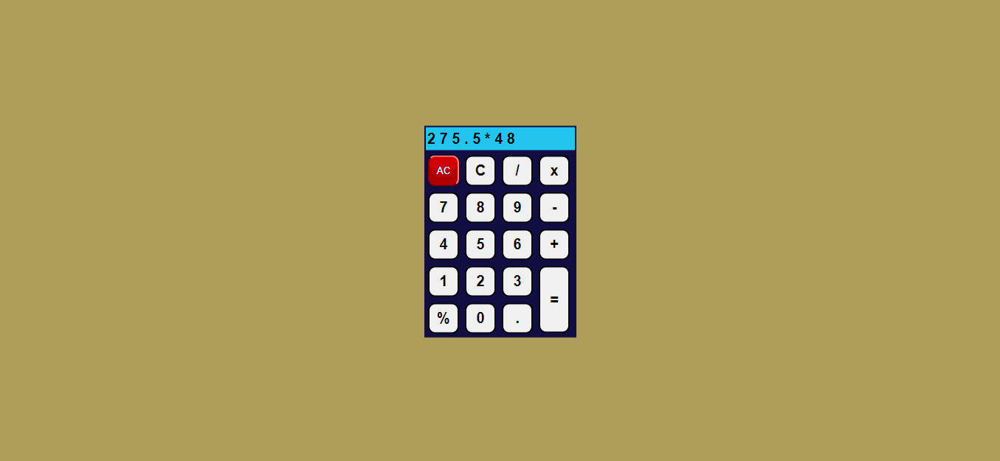

# PRANAV MATHUR

## Learnings from the project:

- String methods like _slice()_, _splice()_, _join()_ and _parseFloat_
- Array methods like _push()_ and _pop()_

## Time taken:

    It took me 3 hours to complete this project.

## Screenshots:

## Live link:

[Go to site](https://06-calculator.netlify.app/)
